# 🚖 Uber Mobility Analytics & Data Science Platform

[](https://uberanalyticsds-zbqrqqyzlgrvvnntclrztg.streamlit.app/)
[](https://www.python.org/)
[](https://powerbi.microsoft.com/)
[](https://www.postgresql.org/)
[]()
[](https://opensource.org/licenses/MIT)

An end-to-end **Data Science and Mobility Analytics project** built using **150,000 Uber booking records**. The project combines data validation, exploratory analysis, PostgreSQL, SQL business analysis, feature engineering, Power BI analytics, machine learning, customer segmentation, location intelligence, and an interactive Streamlit application.

The primary machine learning problem is **Booking Outcome Prediction**, formulated as a multi-class classification problem to predict whether a booking is:

* Completed
* Cancelled by Customer
* Cancelled by Driver
* No Driver Found
* Incomplete

A major focus of the ML pipeline is **preventing data leakage** by ensuring that only information realistically available at the prediction point is used by the model.

---

## 🎯 Project Objective

The goal of this project is to transform raw Uber booking data into a complete analytical and machine learning solution that can answer:

> **What happened? Why did it happen? Where did it happen? Who is affected? Can we predict it? And what should the business do about it?**

The project is designed to demonstrate practical Data Science skills rather than focusing only on visualization.

---

# 📌 Business Problem

Ride-hailing platforms generate large volumes of operational data containing information about customers, vehicles, trips, locations, fares, ratings, booking outcomes, and timestamps.

Understanding this data can help answer important operational and business questions:

* Which booking outcomes are most common?
* Why are bookings failing or being cancelled?
* Which vehicle types have the highest completion rates?
* Which locations experience more failed bookings?
* When does demand and cancellation activity peak?
* Which customers show different usage patterns?
* Which booking characteristics are associated with unsuccessful outcomes?
* Can booking outcomes be predicted before the outcome occurs?
* Which customer groups require different strategies?
* Which locations may require better supply allocation?

---

# 📊 Dataset Overview

The project uses an existing Uber booking dataset rather than unnecessarily generating synthetic records.

### Dataset Characteristics

| Metric           |                    Value |
| ---------------- | -----------------------: |
| Records          |                  150,000 |
| Columns          |                       19 |
| Date Range       | 1 Jan 2025 – 30 Dec 2025 |
| Unique Customers |                  104,114 |
| Vehicle Types    |                        7 |
| Pickup Locations |                      176 |
| Drop Locations   |                      176 |
| Booking Outcomes |                        5 |

### Booking Outcome Distribution

| Booking Status        |    Bookings | Approx. Share |
| --------------------- | ----------: | ------------: |
| Completed             |      93,000 |           62% |
| Cancelled by Driver   |      27,000 |           18% |
| Cancelled by Customer |      10,500 |            7% |
| No Driver Found       |      10,500 |            7% |
| Incomplete            |       9,000 |            6% |
| **Total**             | **150,000** |      **100%** |

---

# 🧠 Core Machine Learning Problem

## Booking Outcome Prediction

The main ML problem is a **multi-class classification task**.

### Target Variable

`Booking_Status`

### Classes

```text
Completed
Cancelled by Customer
Cancelled by Driver
No Driver Found
Incomplete
```

The objective is to predict the likely booking outcome using information that would realistically be available at the defined prediction point.

---

## ⚠️ Data Leakage Prevention

Data leakage is one of the most important considerations in this project.

A model can achieve unrealistically high performance if it is allowed to use information that becomes available only after the booking outcome has already occurred.

Therefore, each candidate feature will be evaluated based on:

### 1. Availability

Was the information available when the prediction was supposed to be made?

### 2. Causal relationship

Was the feature created as a consequence of the booking outcome?

### 3. Business realism

Would Uber realistically have this information at prediction time?

Features that directly reveal or strongly depend on the final booking outcome will be excluded from the predictive pipeline.

The project will explicitly document:

* Prediction point
* Allowed features
* Excluded features
* Leakage risks
* Reasons for feature exclusion

This is intended to make the ML solution more realistic and defensible in a professional Data Science setting.

---

# 🏗️ End-to-End Data Science Workflow

```text
                    RAW UBER DATA
                         │
                         ▼
              ┌─────────────────────┐
              │ Data Understanding  │
              └──────────┬──────────┘
                         │
                         ▼
              ┌─────────────────────┐
              │ Data Validation     │
              │ & Quality Checks    │
              └──────────┬──────────┘
                         │
                         ▼
              ┌─────────────────────┐
              │ Data Cleaning       │
              └──────────┬──────────┘
                         │
                         ▼
              ┌─────────────────────┐
              │ PostgreSQL          │
              │ & SQL Analysis      │
              └──────────┬──────────┘
                         │
                         ▼
              ┌─────────────────────┐
              │ EDA & Business      │
              │ Analysis            │
              └──────────┬──────────┘
                         │
                         ▼
              ┌─────────────────────┐
              │ Feature Engineering │
              └──────────┬──────────┘
                         │
              ┌──────────┴───────────┐
              ▼                      ▼
     ┌─────────────────┐    ┌──────────────────┐
     │ Power BI        │    │ Machine Learning │
     │ Analytics       │    │ Booking Outcome  │
     └─────────────────┘    │ Prediction       │
                            └────────┬─────────┘
                                     │
                       ┌─────────────┴─────────────┐
                       ▼                           ▼
              ┌─────────────────┐       ┌──────────────────┐
              │ Customer        │       │ Location         │
              │ Segmentation    │       │ Intelligence     │
              └────────┬────────┘       └────────┬─────────┘
                       │                         │
                       └────────────┬────────────┘
                                    ▼
                         ┌─────────────────────┐
                         │ Insights &          │
                         │ Recommendations     │
                         └──────────┬──────────┘
                                    │
                                    ▼
                         ┌─────────────────────┐
                         │ Streamlit           │
                         │ Application         │
                         └──────────┬──────────┘
                                    │
                                    ▼
                         ┌─────────────────────┐
                         │ GitHub / Portfolio  │
                         └─────────────────────┘
```

---

# 🔍 1. Data Understanding & Validation

The first stage focuses on understanding the raw dataset before performing analysis or modeling.

Validation areas include:

* Dataset structure
* Column validation
* Data types
* Missing values
* Duplicate records
* Unique identifiers
* Date ranges
* Numerical ranges
* Categorical values
* Business-rule validation
* Potential anomalies
* Target variable distribution

The objective is to ensure that analytical conclusions are based on reliable data.

---

# 🧹 2. Data Cleaning

Data cleaning is performed based on the actual characteristics of the dataset.

Potential treatments include:

* Missing-value handling
* Duplicate removal where justified
* Data-type correction
* Invalid-value handling
* Date/time standardization
* Categorical-value standardization
* Outlier treatment where appropriate

Cleaning decisions are documented rather than applying automatic deletion or imputation rules.

---

# 🐘 3. PostgreSQL & SQL Analytics

The validated dataset is loaded into PostgreSQL for relational analysis.

SQL analysis focuses on real business questions rather than demonstrating SQL syntax alone.

### Example analytical areas

#### Booking Performance

* Total bookings
* Completed bookings
* Cancellation rates
* Booking outcome distribution

#### Customer Analysis

* Unique customers
* Repeat customers
* Booking frequency
* Customer-level booking behavior

#### Vehicle Analysis

* Bookings by vehicle type
* Completion rate by vehicle
* Cancellation rate by vehicle
* Revenue contribution by vehicle

#### Location Analysis

* Top pickup locations
* Top drop locations
* High-cancellation locations
* High-completion locations

#### Time Analysis

* Monthly booking trends
* Day-of-week patterns
* Hourly demand
* Peak booking periods

#### Revenue Analysis

* Total revenue
* Average fare
* Revenue by vehicle
* Revenue by location
* Revenue associated with completed trips

---

# 📈 4. Exploratory Data Analysis

Python-based EDA is used to understand patterns and relationships in the dataset.

### Tools

* Python
* Pandas
* NumPy
* Matplotlib
* Seaborn
* Plotly where appropriate

### EDA Areas

* Univariate analysis
* Bivariate analysis
* Multivariate analysis
* Time-series patterns
* Booking outcomes
* Customer behavior
* Vehicle performance
* Revenue patterns
* Location patterns

The objective is not to create charts for the sake of visualization.

Each important visualization should answer a business question and contribute to an analytical conclusion.

---

# 💼 5. Business Analysis

EDA findings are converted into business-oriented insights.

For example:

### Observation

> Driver cancellations are higher for a particular vehicle category.

### Business Insight

> The vehicle category shows a disproportionately high driver cancellation rate, indicating a potential operational or supply-side issue requiring further investigation.

The final recommendations will be based on evidence from the dataset rather than assumptions.

---

# ⚙️ 6. Feature Engineering

Feature engineering converts raw variables into features that can provide additional analytical and predictive value.

Potential features include:

### Time Features

* Year
* Month
* Month Number
* Day
* Day of Week
* Weekend Flag
* Hour
* Peak/Non-Peak Indicator

### Customer Features

* Booking frequency
* Completed booking count
* Cancellation count
* Cancellation rate
* Average fare
* Average distance

### Trip Features

* Distance categories
* Fare per kilometre
* Duration categories
* Average speed where logically valid

### Location Features

* Pickup demand
* Drop demand
* Location completion rate
* Location cancellation rate

Not every possible feature will automatically be created.

Each feature will be evaluated for:

* Business relevance
* Predictive usefulness
* Availability at prediction time
* Leakage risk

---

# 🤖 7. Machine Learning

## Booking Outcome Prediction

The primary ML model predicts:

```text
Completed
Cancelled by Customer
Cancelled by Driver
No Driver Found
Incomplete
```

### Planned ML Pipeline

```text
Validated Data
      ↓
Leakage Analysis
      ↓
Feature Selection
      ↓
Train/Test Strategy
      ↓
Preprocessing
      ↓
Baseline Model
      ↓
Model Training
      ↓
Model Comparison
      ↓
Hyperparameter Tuning
      ↓
Final Model
      ↓
Evaluation
      ↓
Interpretability
```

### Models to Evaluate

Depending on the dataset and results:

* Logistic Regression
* Decision Tree
* Random Forest
* Gradient Boosting
* Other suitable classification models

The most complex model will not automatically be considered the best model.

---

## 📏 Model Evaluation

Because the target contains multiple classes, model performance will not be evaluated using accuracy alone.

Metrics may include:

* Accuracy
* Precision
* Recall
* F1-score
* Macro F1
* Weighted F1
* Confusion Matrix

**Macro F1** will receive particular attention because it gives equal importance to each booking-outcome class.

Class imbalance will also be evaluated before deciding whether techniques such as class weighting or resampling are appropriate.

---

# 🔎 8. Model Interpretability

The final model should not be treated as a black box.

Interpretability techniques may include:

* Feature importance
* Permutation importance
* SHAP, where appropriate

The objective is to understand:

> Which factors are most associated with different booking outcomes?

This allows the model to produce both predictive and business value.

---

# 👥 9. Customer / Rider Segmentation

A separate unsupervised learning problem will be used to identify customer behavior patterns.

Potential segmentation features include:

* Booking frequency
* Completed bookings
* Cancellation rate
* Average fare
* Average trip distance
* Recency where meaningful

Potential techniques:

* K-Means
* Hierarchical Clustering
* Other clustering methods where justified

Cluster quality can be evaluated using:

* Elbow Method
* Silhouette Score

The final clusters will be translated into meaningful customer profiles based on actual behavioral characteristics.

---

# 📍 10. Location Intelligence

Location-level analysis will identify operational patterns across pickup and drop locations.

Key areas include:

* High-demand pickup locations
* High-demand drop locations
* High-cancellation locations
* High-completion locations
* Location-specific booking outcomes
* High-value corridors
* Potential supply-demand imbalance

Where geographic coordinates are available, spatial analysis can be performed.

Where only location names are available, external geographic enrichment will only be introduced if genuinely necessary.

---

# 📊 11. Power BI Analytics

Power BI provides the business-facing analytics layer.

The dashboard focuses on executive and operational decision-making rather than duplicating Python EDA.

## Current Power BI Suite

### 1. Executive Home & Navigation Hub

Central dashboard containing high-level KPIs and navigation.

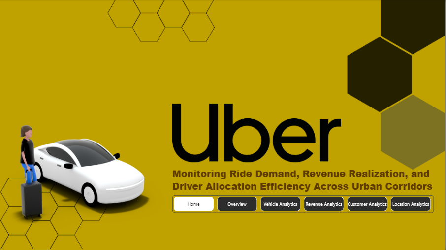

### 2. Operational Overview

Analyzes:

* Booking demand
* Hourly patterns
* Booking outcomes
* Cancellation activity

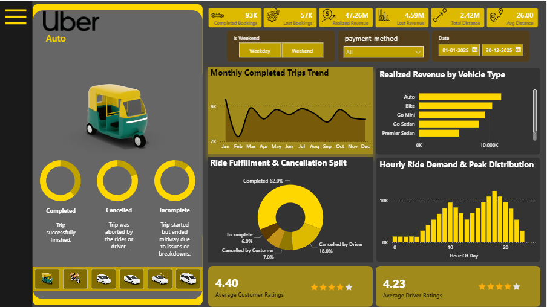

### 3. Fleet & Vehicle Analytics

Analyzes:

* Vehicle performance
* Booking distribution
* Revenue contribution
* Ratings
* Vehicle-level operational metrics

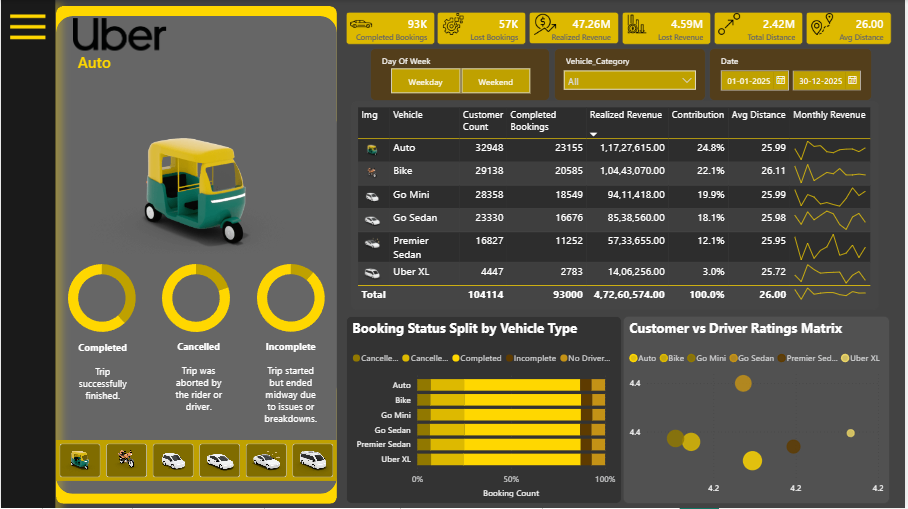

### 4. Revenue & Cancellation Analytics

Analyzes:

* Revenue patterns
* Cancellation patterns
* Temporal trends
* Revenue leakage

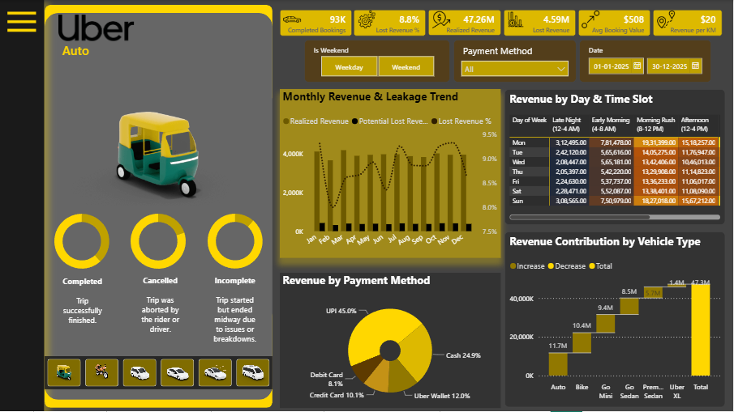

### 5. Customer Analytics

Analyzes:

* Customer behavior
* Ratings
* Cancellation patterns
* Customer experience indicators

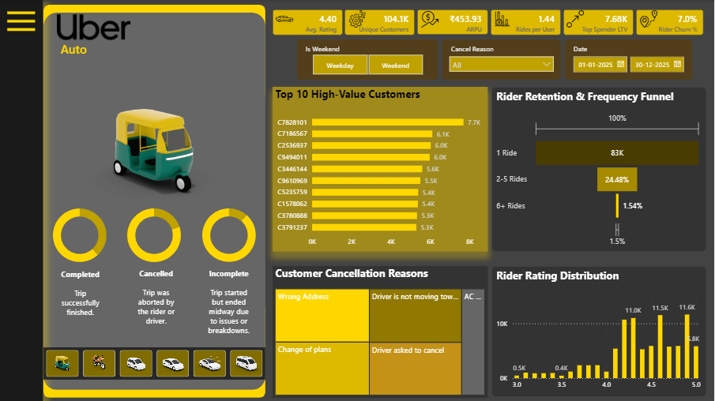

### 6. Location Analytics

Analyzes:

* Pickup hubs
* Drop hubs
* Location density
* Mobility flows

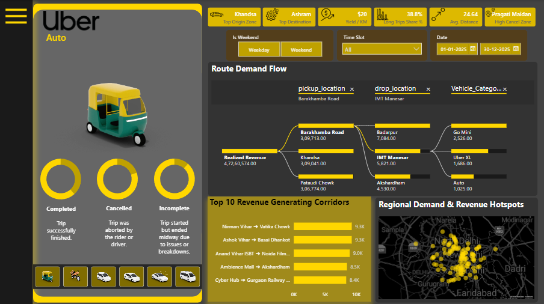

### 7. Navigation System

Custom sidebar navigation for moving between analytical sections.

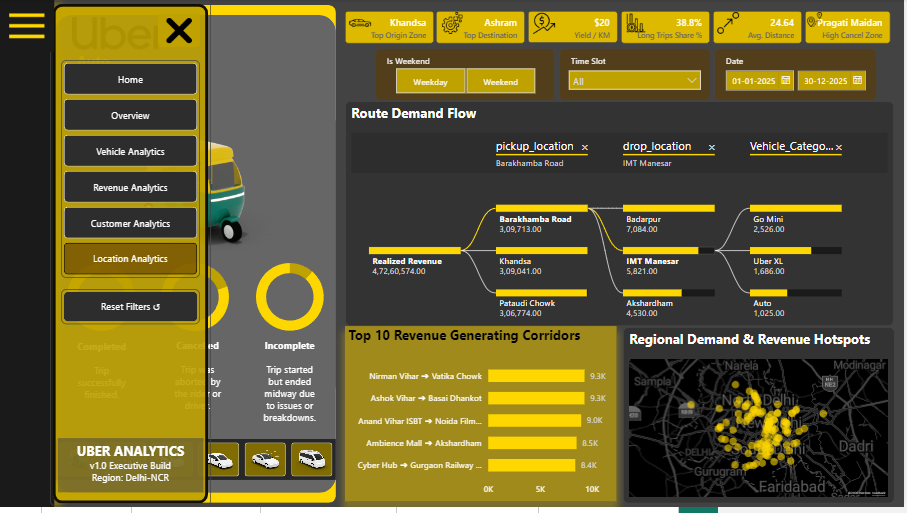

---

# 🚀 12. Streamlit Application

A Streamlit application provides an interactive application layer for the project.

## Current Application

### Executive Intelligence Hub

Provides an overview of:

* Core KPIs
* Booking outcome distribution
* Vehicle performance
* Revenue distribution

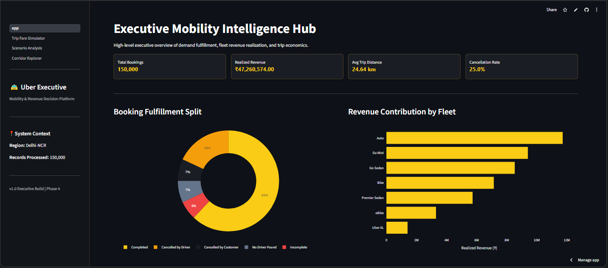

### Trip Fare Simulator

An interactive **what-if simulation tool** for exploring fare scenarios based on available trip characteristics and user-defined assumptions.

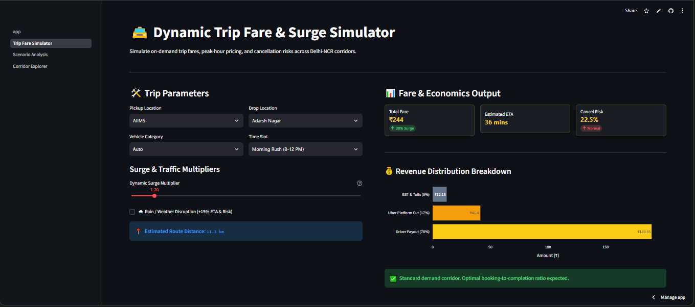

### Driver Incentive Scenario Analysis

An interactive scenario tool for evaluating hypothetical incentive assumptions and their potential financial impact.

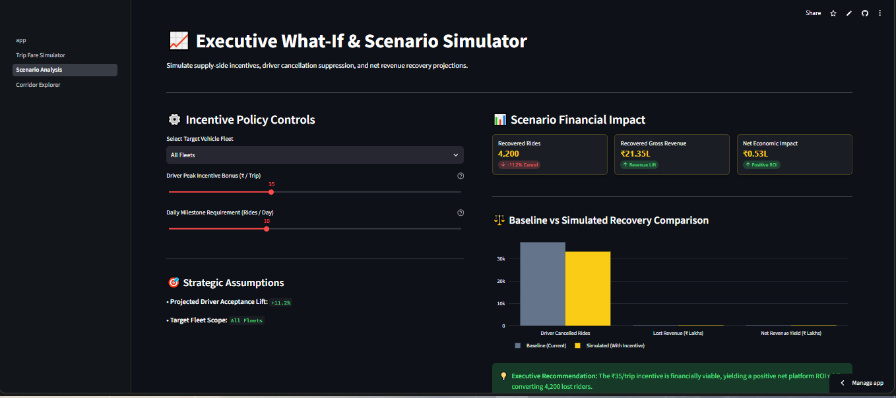

### Corridor Explorer

Analyzes high-value routes and corridor-level performance.

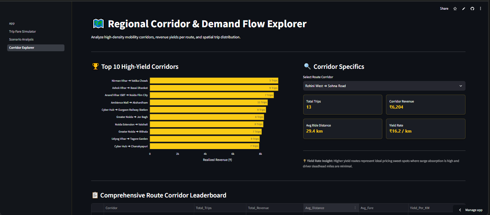

### Corridor Leaderboard

Provides a broader route-level comparison.

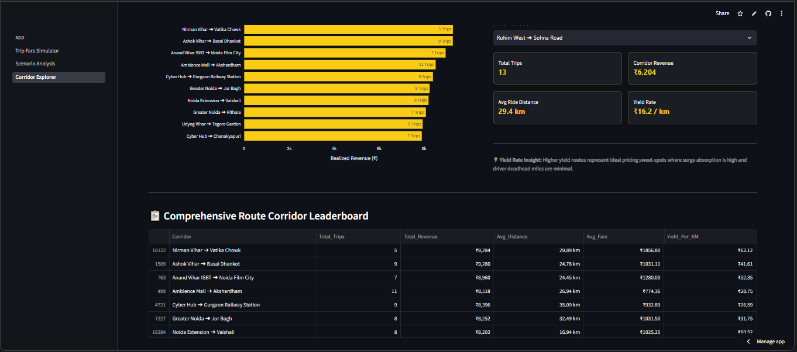

> **Important:** The current Streamlit simulators are decision-support tools. They are not presented as machine learning models. The actual ML prediction module will be integrated after the Booking Outcome Prediction pipeline is completed.

---

# 💡 13. Strategic Insights & Recommendations

Business recommendations will be generated from validated analytical findings.

The final recommendation framework will follow:

```text
Finding
   ↓
Evidence
   ↓
Business Impact
   ↓
Recommended Action
   ↓
Expected Outcome
```

Potential areas of recommendation include:

### Driver Supply

Identify locations and time periods where driver availability may be insufficient.

### Cancellation Reduction

Investigate operational factors associated with high cancellation rates.

### Customer Experience

Identify customer groups and booking conditions associated with poor outcomes.

### Vehicle Allocation

Evaluate whether vehicle supply is appropriately aligned with demand.

### Location Strategy

Prioritize operational improvements in high-demand or high-failure locations.

Recommendations will be updated as the analytical and ML phases are completed.

---

# 🛠️ Technology Stack

| Category          | Technology                  |
| ----------------- | --------------------------- |
| Programming       | Python 3.13                 |
| Data Manipulation | Pandas, NumPy               |
| Visualization     | Matplotlib, Seaborn, Plotly |
| Database          | PostgreSQL                  |
| SQL               | PostgreSQL SQL              |
| BI                | Power BI                    |
| Machine Learning  | Scikit-learn                |
| Application       | Streamlit                   |
| Version Control   | Git & GitHub                |

Additional libraries will only be introduced when they provide genuine project value.

---

# 📁 Repository Structure

```text
Uber_Analytics_DS/
│
├── assets/
│   └── screenshots/
│
├── data/
│   ├── raw/
│   └── processed/
│
├── notebooks/
│   ├── 01_data_understanding.ipynb
│   ├── 02_exploratory_data_analysis.ipynb
│   ├── 03_feature_engineering.ipynb
│   ├── 04_booking_outcome_prediction.ipynb
│   └── 05_customer_segmentation.ipynb
│
├── powerbi/
│   ├── uber_executive_analytics.pbix
│   └── uber_theme.json
│
├── sql/
│   ├── 01_schema_setup.sql
│   ├── 02_load_data.sql
│   └── 03_business_queries.sql
│
├── src/
│   ├── data_processing/
│   ├── features/
│   ├── models/
│   └── utils/
│
├── streamlit_app/
│   ├── app.py
│   ├── config.py
│   └── pages/
│       ├── 1_Trip_Fare_Simulator.py
│       ├── 2_Scenario_Analysis.py
│       ├── 3_Corridor_Explorer.py
│       └── 4_Booking_Prediction.py
│
├── reports/
│
├── .env.example
├── .gitignore
├── PROJECT_PLAN.md
├── README.md
└── requirements.txt
```

The repository structure may evolve as the ML and segmentation components are implemented.

---

# 🌐 Live Application

### Streamlit

https://uberanalyticsds-zbqrqqyzlgrvvnntclrztg.streamlit.app/

### GitHub

https://github.com/Vipin-Andel/Uber_Analytics_DS

---

# ⚙️ Local Installation

## 1. Clone the repository

```bash
git clone https://github.com/Vipin-Andel/Uber_Analytics_DS.git

cd Uber_Analytics_DS
```

## 2. Create a virtual environment

```bash
python -m venv venv
```

### Windows PowerShell

```bash
.\venv\Scripts\Activate.ps1
```

### macOS / Linux

```bash
source venv/bin/activate
```

## 3. Install dependencies

```bash
pip install -r requirements.txt
```

## 4. Configure environment variables

Create a `.env` file based on `.env.example` and add the required configuration.

## 5. Launch Streamlit

```bash
streamlit run streamlit_app/app.py
```

---

# 📈 Project Status

| Component                     | Status         |
| ----------------------------- | -------------- |
| Dataset Understanding         | ✅ Completed    |
| Data Cleaning                 | ✅ Completed    |
| PostgreSQL                    | ✅ Completed    |
| SQL Analysis                  | ✅ Completed    |
| EDA                           | ✅ Completed    |
| Power BI                      | ✅ Completed    |
| Streamlit Analytics           | ✅ Completed    |
| Feature Engineering           | 🔄 In Progress |
| Booking Outcome Prediction    | 🔄 In Progress |
| Customer Segmentation         | ⏳ Planned      |
| Location Intelligence         | 🔄 In Progress |
| ML Integration into Streamlit | ⏳ Planned      |
| Final Business Insights       | ⏳ Planned      |
| Portfolio Documentation       | ⏳ Planned      |

---

# 🎯 Final Deliverables

The completed project will provide:

* Validated Uber booking dataset
* PostgreSQL database
* Business-focused SQL analysis
* Python EDA
* Feature engineering pipeline
* Power BI executive analytics
* Multi-class booking outcome prediction model
* Leakage analysis and prevention
* Model evaluation and interpretability
* Customer/rider segmentation
* Location intelligence
* Evidence-backed business recommendations
* Streamlit interactive application
* Professional GitHub documentation
* Portfolio-ready project presentation

---

# 🧭 Project Philosophy

This project follows a simple principle:

> **Use the available data to extract maximum analytical and business value without unnecessarily generating data or adding complexity.**

The project is intentionally built as an end-to-end workflow rather than a collection of disconnected notebooks.

The final objective is to demonstrate the complete Data Science lifecycle:

```text
Understand
   ↓
Validate
   ↓
Clean
   ↓
Query
   ↓
Analyze
   ↓
Engineer
   ↓
Visualize
   ↓
Predict
   ↓
Segment
   ↓
Interpret
   ↓
Recommend
   ↓
Deploy
   ↓
Document
```

---

# 👨‍💻 Author

**Vipin Andel**

Data Science | Python | SQL | Power BI | Machine Learning

GitHub:
https://github.com/Vipin-Andel

---

## ⭐ Project Goal

This project is being developed as a portfolio-grade demonstration of how a Data Scientist can take a real-world business dataset from **raw records to actionable intelligence and predictive modeling**.

The emphasis is on:

**Data Quality + Business Understanding + SQL + EDA + Feature Engineering + Machine Learning + Visualization + Deployment + Communication**
